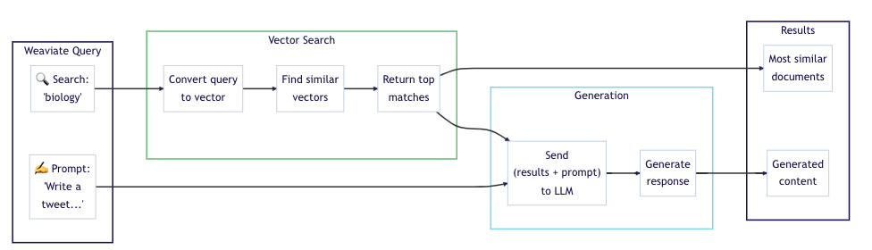
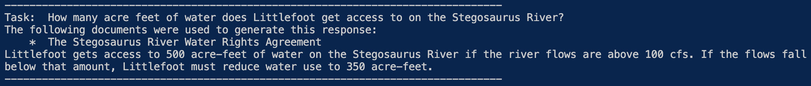

# water-doc-db
Vector Database & Document Search for Water Related Text Documents

# Description
The purpose of this repo is to build the foundation for creating a searchable text database for 
water related documents. A retrieval augmented generation (RAG), or generative search, is 
implemented to search for information contained in text based documents, in this case, related to 
water. Weaviate provides a great illutsration of this [workflow and how to implement it](https://weaviate.io/developers/weaviate/quickstart/local) 
in their documentation.



The documents included in this project may contain information on water policy, water 
regulation, water rights, etc. Often times these documents are in PDF format, which can make 
scanning for information tedious. The goal of this repo is to build a tool that allows users to
configure a locally hosted vector database with Weaviate and Docker.

This repo uses Docker, Weaviate, and the OpenAI API to generate responses to questions and prompts
fed into a user defined query. If the user does not have an OpenAI API key, you can visit
the Weaviate documentation for a [full list of LLMs avialable](https://weaviate.io/developers/weaviate/model-providers) for integration with Weaviate. 
Alternatively, users may also configure their own vector models. 

NOTE: This is bare bones, and has not been fine tuned for accuracy purposes. Users should expect
to develop their own workflows on top of this example, rather than rely on the current structure 
for large scale workflows. 


# Contents
NOTE: This is a bare bones infrastructure, and will evolve over time.


    <water-doc-db>/
    ├─ data/policy_docs                 # contains example PDF documents for ingest
    ├─ src/                             # directory containing analysis code
    │  ├─ confirm_doc_ingest.py         # code to visualize docs which are contained in the db
    │  ├─ delete_object.py              # code to delete a single object from the db
    │  ├─ ingest_docs.py                # code to ingest PDF docs into the db
    │  ├─ setup_schema.py               # schema configuration for the Weaviate vector db
    │  ├─ simple_query.py               # example queries & generative responses from docs in the db
    ├─ .gitignore                       # standard Python gitignore
    ├─ docker-compose.yml               # Docker Compose to deploy Weaviate locally
    ├─ README.md                        # outline of what is contianed in the repo and how to use it
    ├─ requirements.txt                 # libraries required to run the code in this repo


# How to Use
## Install Requirements
In your virtual environment, make sure you have then necessary libraries installe by running:

```bash
pip install -r requirements.txt
```

## Database configuration
Users should have docker desktop installed to run this locally. Run the following command within 
this directory:

```bash
docker-compose up -d
```

This will createa a Wevaite database connection on your local machine. You can test that this 
connection is working correctly by running the following command in a terminal from this repo:

```bash
python quicktart_check_readiness.py
```

If 'True' is returned, the connection is working and you are ready to continue.

To set up a Weaviate database with the defined schema, run the following in a terminal:

```bash
python src/setup_schema.py
```

## Document Ingest
Now, that a Weaviate database and schema has been configured, you are ready to upload documents!
Two text documents have been included in this repo in data/policy docs. One is the Colorado River 
Compact, and the other is an imaginary water rights agreement. These documents will be queried and
used as reference in the generative responses output when using the sample queries. 

NOTE: These two documents should *already* be included in the data base. Before re-adding these 
documents, you can check this by running:

```bash
python src/confirm_doc_ingest.py
```

If you would like to add additional docs into the database, that may be done with the below
workflow.

The workflow to ingest documents can be run with the following for a single file
```bash
python src/ingest_docs.py -i single
```

or with the below to ingest all files in the policy_docs directory:
```bash
python src/ingest_docs.py -i all
```

Currently this workflow is configured under the assumption that the document to be ingested is in 
PDF format and contained in the data/policy_docs directory.

## Now the Fun - Queries and Questions!
Now the best part! Modify the queries to output generative responses based on the text documents 
you've uploaded into the database and run:

```bash
python src/simple_query.py
```

This file is pre-configured with example
queries to illustrate that the text search capabilities meet a minimum requirement of logic.



# Shut Down
When you are done exploring, don't forget to shut down the docker container with the following 
command:

 ```bash
docker-compose down
```